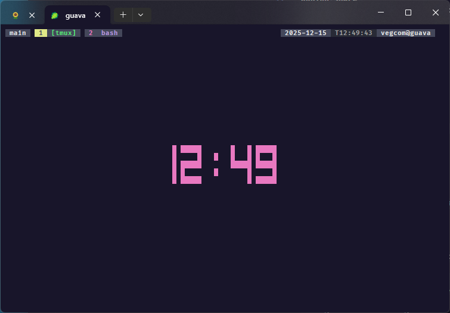
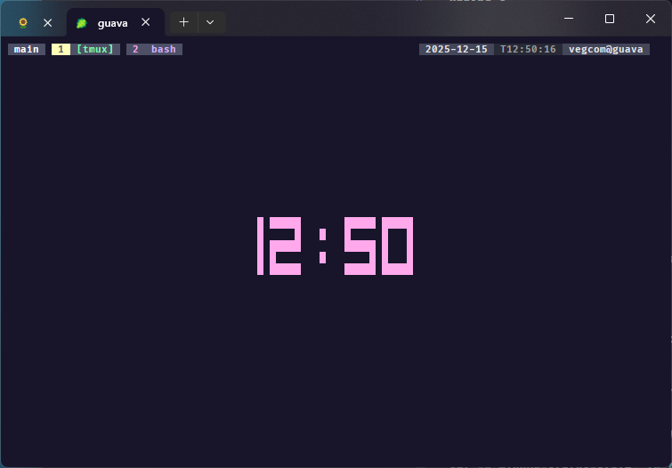

# Twilite for Tmux


## Description

Dark, vibrant theme inspired by [Twilite Theme](https://github.com/vegcom/Twilite-Theme). Truecolor RGB support for tmux-256color.

## Screenshots

### Twilite


### Twilite Darker



## Install
1. Backup your `~/.tmux.conf`.
2. `cp twilite-tmux.conf ~/.tmux.conf` (or symlink: `ln -s /path/to/twilite-tmux.conf ~/.tmux.conf`).
3. Reload: `tmux source-file ~/.tmux.conf` or restart tmux.
4. Ensure your term supports RGB: `echo $TERM` should be `tmux-256color` or similar.

For the darker variant: Use `twilite-darker-tmux.conf`.


```shell
wget -O ~/.tmux.conf https://raw.githubusercontent.com/vegcom/Tmux-Twilite/main/twilite-tmux.conf

```

### Optional features

[tmux-plugins/tpm](https://github.com/tmux-plugins/tpm)

```shell
git clone https://github.com/tmux-plugins/tpm ~/.tmux/plugins/tpm

```

## Colors
Matches [twilite.json](https://raw.githubusercontent.com/vegcom/Twilite-Theme/refs/heads/main/twilite.json) / [twilite-darker.json](https://raw.githubusercontent.com/vegcom/Twilite-Theme/refs/heads/main/twilite-darker.json) palette. Full hex mapping:
- background: #18152a / #141025
- ... (table or embed palette preview)

## Features
- Custom keybinds (C-x prefix, vim-like panes).
- TPM plugins (resurrect, continuum, etc.).
- Top status bar, mouse support, activity monitoring.

## Related
- VSCode: [Twilite theme](link if exists).
- Preview script? (if you have generate_previews.py)


MIT License. PRs welcome!


